# Chrono Trigger Campfire - Diorama Raytracer 🌌🔥

Raytracer CPU 3D desarrollado desde cero en Rust con `raylib`, renderizando un diorama voxel interactivo inspirado en la emblemática escena del campamento nocturno de *Chrono Trigger* (SNES). El motor implementa trazado de rayos puro paralelizado con Rayon, aceleración espacial mediante un Voxel Grid con DDA 3D (Amanatides-Woo), terreno generado proceduralmente con ruido fractal, iluminación con sombras duras y suaves (blob shadows), reflexión recursiva con efecto Fresnel, refracción contextual de Snell, mapas de normales en espacio tangente, materiales emisivos, skybox procedural estrellado y sprites billboard con transiciones cinematográficas suaves de cámara.

| Render del Raytracer (Encuadre Inicial) | Diorama de Referencia e Inspiración |
|:---:|:---:|
| 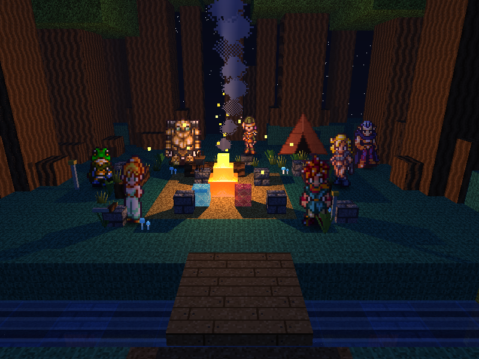 |  |

---

## Screenshots

### Encuadre Inicial y Vista Cenital
| Encuadre Inicial (Tecla 1) | Vista Cenital Elevada (Tecla 2) |
|---|---|
|  | 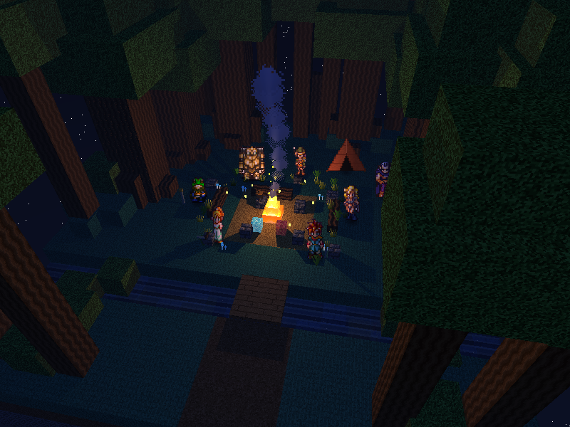 |

### Reflexión en el Arroyo (Efecto Fresnel)
*El cauce del arroyo refleja la vegetación, el puente de tablones, las estrellas del cielo y el brillo nocturno con aproximación de Schlick ($r_0 = 0.15$, $n = 1.33$):*

| Reflexiones ON (Tecla X) | Reflexiones OFF |
|---|---|
| 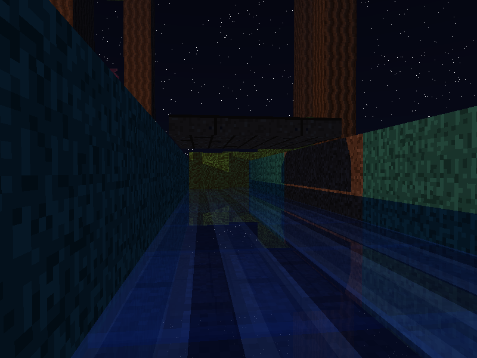 | 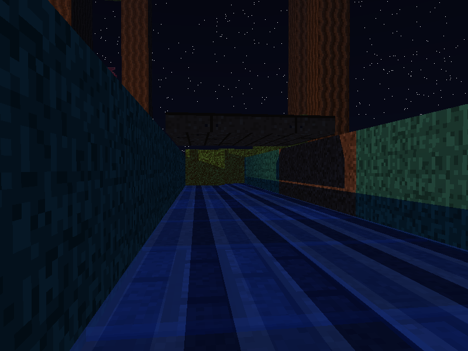 |

### Relieve con Mapas Normales (Espacio Tangente)
*Evaluación rasante sobre el tronco de asiento libre (Toma 6 / F2), iluminado por la fogata:*

| Normal Maps ON (Tecla N) | Normal Maps OFF |
|---|---|
| 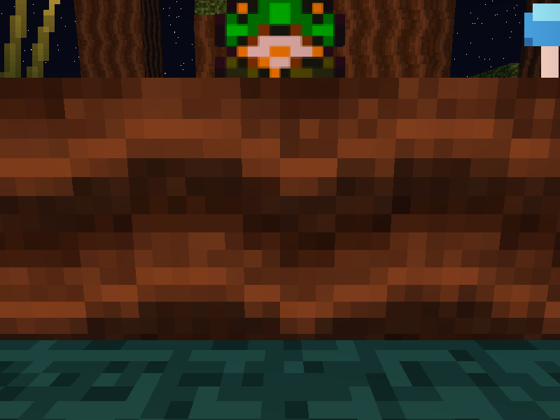 | 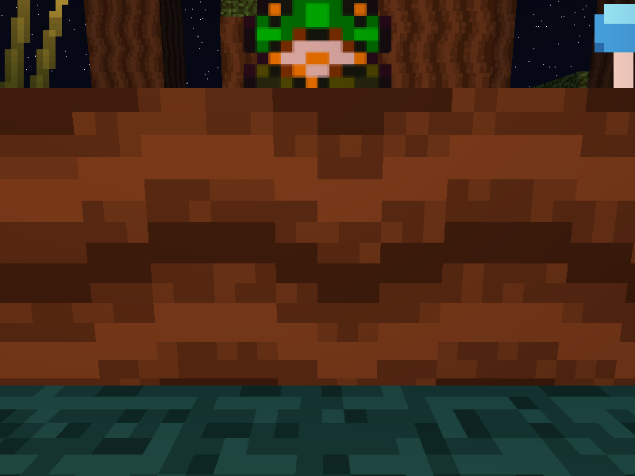 |

### Refracción y Elementos Mágicos
| Cristales Translúcidos (F1 - Snell $n=1.50$) | Portal del Tiempo Escondido (F4 - Gate Vortex) |
|---|---|
| 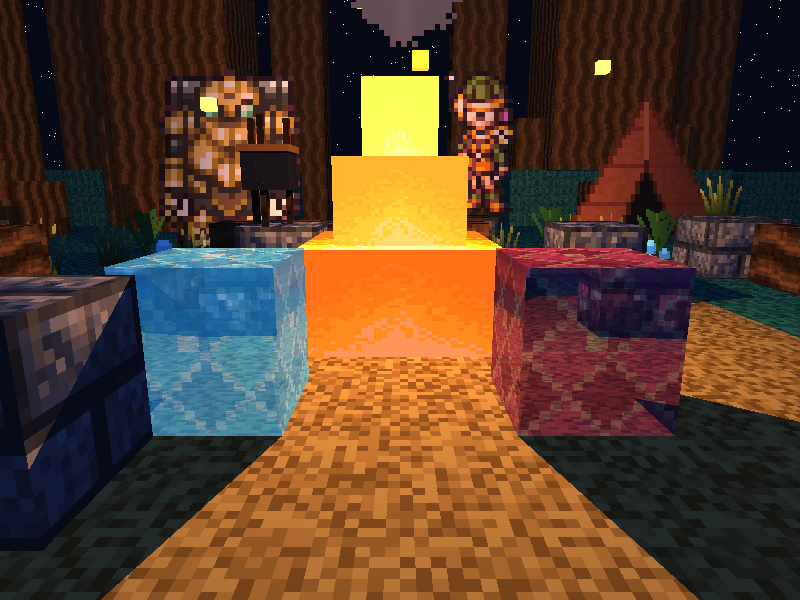 | 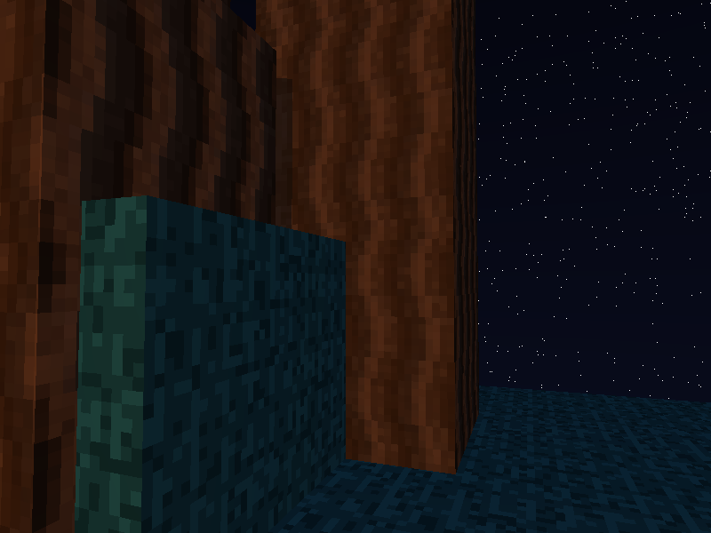 |

### Humo Procedural y Partes de la Escena
| Humo Elevándose hacia las Estrellas (F3) | Frog junto a la Espada Masamune |
|---|---|
| 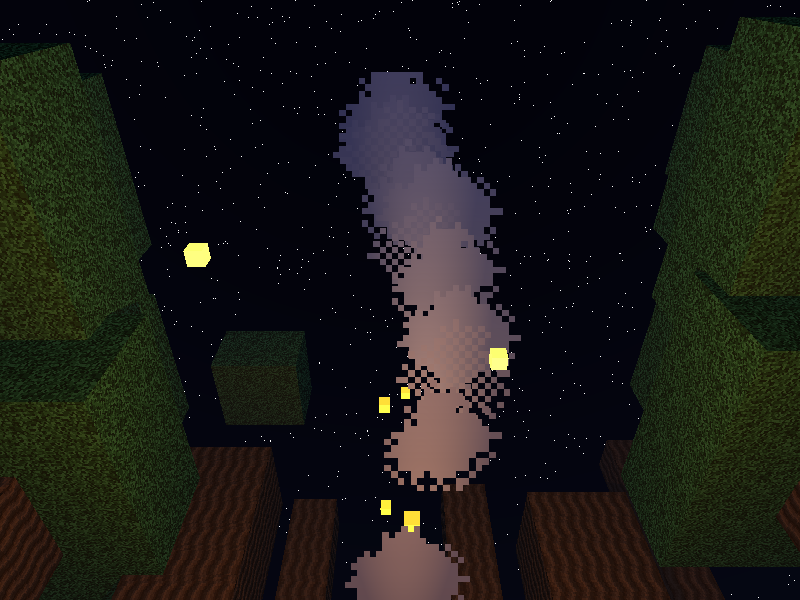 | 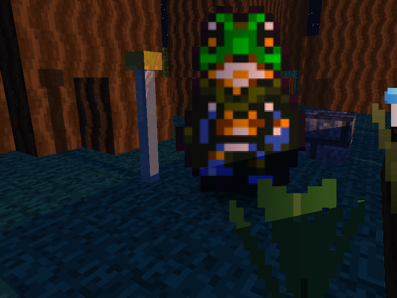 |

### Primeros Planos de la Party (Teclas 3 a 9)
| Chrono (3) | Marle (4) | Lucca (5) | Robo (6) |
|:---:|:---:|:---:|:---:|
| 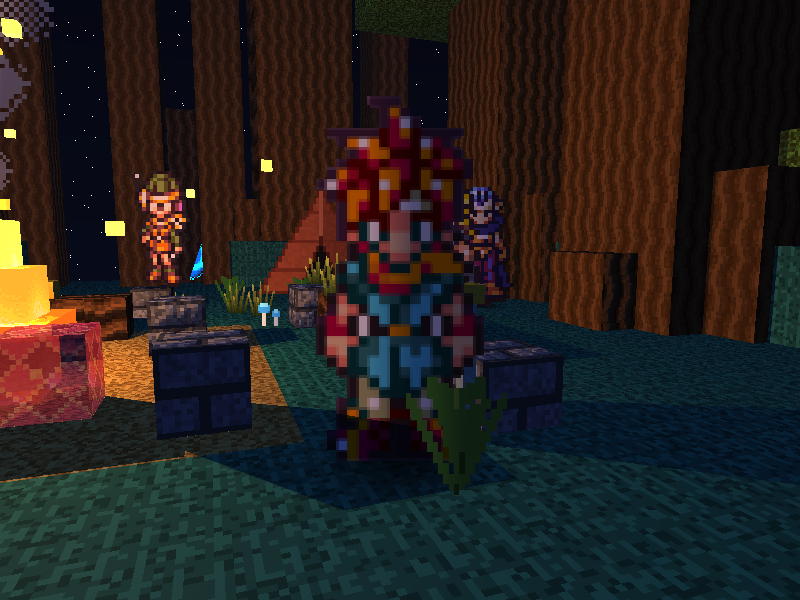 | 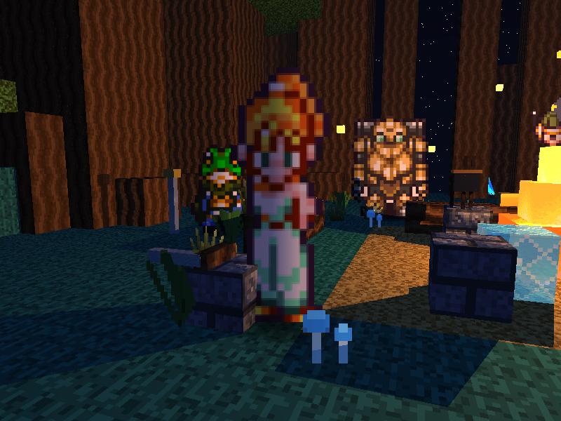 | 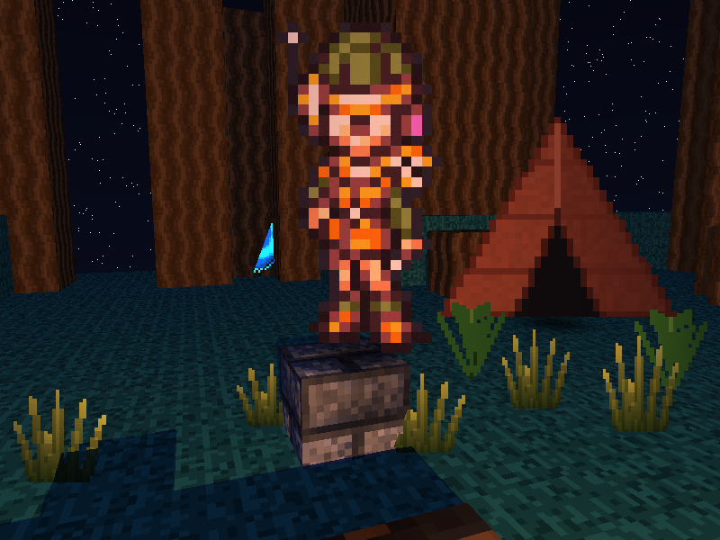 | 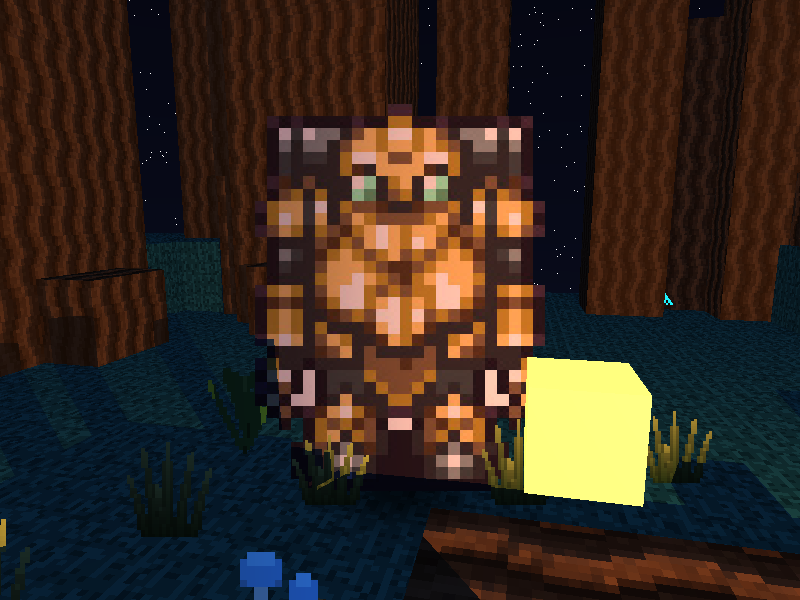 |

| Frog (7) | Ayla (8) | Magus (9) |
|:---:|:---:|:---:|
| 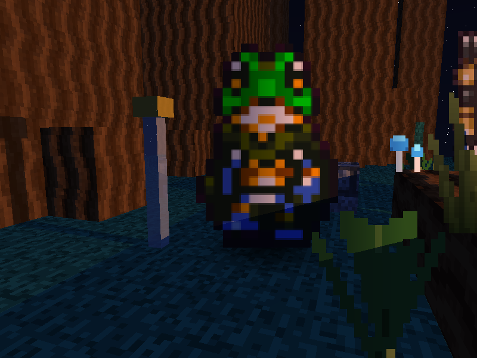 | 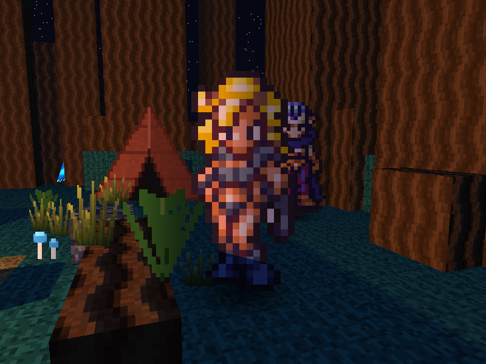 | 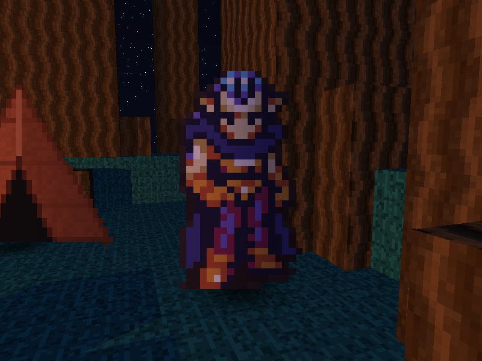 |

---

## Cómo correr el proyecto

### Requisitos

- **Rust + Cargo** (edición 2021 o superior)
- Dependencias de sistema de `raylib` (en Linux: `libasound2-dev`, `libgl1-mesa-dev`, `libx11-dev`, `libxrandr-dev`, `libxi-dev`)
- Sistema de audio ALSA/PulseAudio/PipeWire (si no hay dispositivo de audio disponible, el motor cae automáticamente a silencio sin fallar ni cerrarse)

### Build y ejecución

```bash
cargo run --release
```

> **NOTA IMPORTANTE:** Se recomienda encarecidamente compilar siempre con `--release`. El trazado de rayos por CPU evalúa reflexiones, refracciones y sombras para cada uno de los 480,000 píxeles (800x600). En modo debug Rust no optimiza el inlining ni las instrucciones vectoriales SIMD, mientras que en release se alcanzan tasas interactivas fluidas (≤ 30 ms por frame completo en reposo).

### Verificación automática de layout y rúbrica

El proyecto incluye un arnés de pruebas automatizado que evalúa por raytracing primario la visibilidad sin oclusiones de los personajes, solape de bounding boxes en pantalla, ocupación de encuadres y visibilidad orbital del portal:

```bash
cargo run --release -- --check-layout
```

### Generación de suite oficial de documentación

Regenera automáticamente las 17 capturas oficiales en `docs/screenshots/` con cámaras y estados fijos de material:

```bash
cargo run --release -- --docs
```

### Renderizado de frames de órbita 360°

Para exportar los 24 frames de rotación completa alrededor del diorama:

```bash
cargo run --release -- --frames 24
```

---

## Controles

| Acción | Tecla / Input |
|---|---|
| **Mover punto de mira (adelante / atrás)** | `W` / `S` |
| **Mover punto de mira (izquierda / derecha)** | `A` / `D` |
| **Subir / bajar altura del punto de mira** | `Q` / `E` |
| **Acelerar movimiento del punto de mira (2.5x)** | `Shift` (izquierdo o derecho) |
| **Orbitar horizontalmente alrededor del centro** | Flechas `Izquierda` / `Derecha` |
| **Orbitar verticalmente (elevación)** | Flechas `Arriba` / `Abajo` |
| **Zoom cámara (acercar / alejar)** | `Rueda del Ratón` |
| **Auto-órbita continua 360°** | `R` |
| **Alternar mapas de normales (ON / OFF)** | `N` |
| **Alternar reflexiones y Fresnel (ON / OFF)** | `X` |
| **Preset 1: Encuadre inicial mirando a la fogata** | `1` |
| **Preset 2: Vista cenital / elevada general** | `2` |
| **Primer plano: Chrono** | `3` |
| **Primer plano: Marle** | `4` |
| **Primer plano: Lucca** | `5` |
| **Primer plano: Robo** | `6` |
| **Primer plano: Frog (con Masamune)** | `7` |
| **Primer plano: Ayla** | `8` |
| **Primer plano: Magus** | `9` |
| **Toma Especial F1: Closeup de gemas mágicas y refracción** | `F1` |
| **Toma Especial F2: Tronco rasante para inspección normal map** | `F2` |
| **Toma Especial F3: Humo elevándose hacia el cielo nocturno** | `F3` |
| **Toma Especial F4: Closeup del portal cósmico escondido** | `F4` |
| **Cerrar ventana** | `Esc` |

*Todas las teclas numéricas (`1-9`) y de funciones especiales (`F1-F4`) realizan una transición de cámara interpolada suavemente (~0.5 s con curva ease in/out) que puede ser cancelada inmediatamente por controles manuales.*

---

## Características y Arquitectura Técnica

### 1. Motor de Raytracing y Shading
- **Reflexión Recursiva & Fresnel de Schlick:** El agua implementa reflexión con aproximación de Schlick $r = r_0 + (1 - r_0)(1 - \cos\theta)^5$ con $r_0 = 0.15$ y refracción $n = 1.33$. Limitado estrictamente a 1 nivel de recursión para máximo rendimiento.
- **Refracción Contextual de Snell:** Gemas translúcidas de cristal cian y magenta con índice de refracción $n = 1.50$, transparencia del 60% y soporte de reflexión interna total cuando el ángulo crítico es superado.
- **Mapas de Normales:** Perturbación de la normal superficial de cada cara cúbica en espacio tangente a partir de texturas RGBA (corteza de árboles y adoquines de piedra), alternable en caliente con la tecla `N`.
- **Materiales Emisivos:** Llama de la fogata en 3 bloques decrecientes con gradiente de emisión cálido, cristales luminosos, olla de campamento, hongos bioluminiscentes, luciérnagas flotantes y portal cósmico autoiluminado.
- **Skybox Estrellado:** Gradiente esférico procedural azul noche Chrono Trigger con campo estelar pseudo-aleatorio generado en runtime mediante dispersión angular hash determinista.
- **Iluminación & Sombras:** Luz puntual de fogata con atenuación cuadrática suave y sombras proyectadas directas, complementada por luz de relleno celeste cenital y sombras circulares de contacto (*blob shadows*) bajo la base de cada sprite.

### 2. Aceleración Espacial y Paralelismo
- **Grid Voxel 3D Uniforme:** Recorrido DDA 3D rápido (algoritmo de Amanatides-Woo) que reduce la complejidad de intersección de $O(N)$ cubos a pasos de celda de cuadrícula constantes.
- **Poda por AABBs:** Los billboards de personajes, vegetación y partículas de humo están jerarquizados en cuadrantes de cajas envolventes alineadas con los ejes (AABBs), permitiendo descartar grupos enteros con un test de rayos veloz.
- **Multithreading con Rayon:** El framebuffer se divide en chunks de filas procesados concurrentemente en todos los núcleos de la CPU.
- **Resolución Progresiva:** Durante movimiento o navegación libre interactiva, el renderizador calcula a resolución media (1/2 res) manteniendo 60 FPS estables, pasando automáticamente a resolución completa nativa (800x600) en cuanto la cámara entra en reposo.
- **Tree Cutaway Dinámico:** Durante la auto-órbita continua, los troncos o copas que se interponen a corta distancia entre la cámara y el centro del campamento se podan dinámicamente para nunca obstruir la escena.

### 3. Generación Procedural de Terreno
- Terreno isla flotante de **20x20 bloques** generado con ruido fractal OpenSimplex (`Fbm`), con columna sólida hasta $y=0$.
- Claro central plano a cota fija para el campamento con círculo de paja rústica.
- Sendero de tierra apisonada que cruza hacia el sur.
- Cauce de arroyo hundido con lecho de grava y superficie de agua reflectiva translúcida.

### 4. Audio Ambiental
- Inicialización segura del subsistema de audio de Raylib reproduciendo en streaming la melodía *Secret of the Forest* de Yasunori Mitsuda (*Chrono Trigger* OST).
- Si el entorno carece de tarjeta de sonido o driver de audio compatible, el motor detecta la condición sin lanzar excepciones y continúa silenciosamente sin degradar el rendimiento gráfico.

---

## Estructura del Proyecto

```
proy2-graficas/
├── assets/
│   ├── audio/              # Pista musical Secret of the Forest.mp3
│   ├── party/              # Sprites pixel art oficiales de los 7 personajes
│   ├── bark.png            # Textura de corteza de árboles y troncos
│   ├── bark_normal.png     # Mapa normal de relieve para corteza
│   ├── stone.png           # Textura de piedra
│   ├── stone_normal.png    # Mapa normal para piedra
│   ├── water.png           # Textura de agua translúcida
│   ├── gem_cyan.png        # Cristal refractivo cian
│   ├── gem_magenta.png     # Cristal refractivo magenta
│   ├── gate_vortex.png     # Textura procedural del portal del tiempo
│   └── ...                 # Texturas de pasto, hojas, helechos, paja, humo
├── docs/
│   ├── Reference_image.webp # Imagen de referencia e inspiración
│   └── screenshots/        # Suite oficial de las 17 capturas del proyecto
├── src/
│   ├── main.rs             # Loop principal, manejo de eventos, presets y suite --check-layout
│   ├── raytrace.rs         # Trazador de rayos CPU: sombreado Phong, Fresnel, Snell y Rayon
│   ├── scene.rs            # Ensamblado del diorama: árboles gigantes, props, luces y fogata
│   ├── grid.rs             # Voxel Grid 3D acelerado con algoritmo Amanatides-Woo DDA
│   ├── cube.rs             # Geometría cúbica orientada a ejes, cálculo de normales y UVs
│   ├── material.rs         # Definición de materiales: albedo, specular, refracción, Fresnel
│   ├── camera.rs           # Cámara orbital esférica, matriz de vista y resolución de colisiones
│   ├── procedural.rs       # Generación procedural del terreno 20x20 con OpenSimplex Fbm
│   ├── texture.rs          # Gestor de texturas CPU/GPU con muestreo bilinear/clamp
│   ├── texture_gen.rs      # Generadores procedurales de texturas auxiliares y normal maps
│   ├── billboard.rs        # Primitiva de sprite plano 2.5D orientado a cámara con canal alfa
│   ├── light.rs            # Fuentes de luz puntuales y ambientales con atenuación
│   └── skybox.rs           # Generador del cielo nocturno estrellado procedural
├── Cargo.toml
└── README.md
```

---

## Checklist de Puntos (Rúbrica del Proyecto)

| Criterio de Evaluación | Puntos Posibles | Estado | Justificación / Implementación |
|---|:---:|:---:|---|
| **Complejidad de la Escena** (criterio subjetivo) | **20 pts** | ✅ Cumplido | Diorama completo de campamento: 6 árboles gigantes con raíces y copas orgánicas, 14 troncos perimetrales, fogata con olla en trípode, tienda de campaña, espada Masamune, colgante real de Marle, vegetación (pastos, helechos, hongos bioluminiscentes), 11 partículas de humo y los 7 miembros de la party. |
| **Atractivo Visual de la Escena** (criterio subjetivo) | **15 pts** | ✅ Cumplido | Estética fiel al pixel art de SNES de *Chrono Trigger* integrada armoniosamente en 3D voxel: iluminación cálida de fogata, tinte ambiental azul nocturno, cielo estrellado y agua reflectiva. |
| **Programación Paralela y Optimización** (criterio subjetivo) | **10 pts** | ✅ Cumplido | Paralelización multinúcleo con Rayon por bloques de filas, aceleración espacial Voxel Grid DDA 3D (Amanatides-Woo), jerarquía de AABBs para billboards y resolución adaptativa en movimiento (≤ 30 ms en reposo a 800x600). |
| **Rotación en Diorama y Zoom** | **10 pts** | ✅ Cumplido | Cámara orbital completa con elevación y azimut (Flechas), zoom mediante rueda del ratón y modo de auto-órbita continua de 360° (tecla `R`). |
| **5 Materiales Diferentes (Textura, Albedo, Specular, Transparencia, Reflectividad)** | **25 pts** | ✅ Cumplido | **1. Pasto:** Textura albedo mate orgánica.<br>**2. Piedra:** Alta rugosidad, mapa normal y specular.<br>**3. Madera/Corteza:** Textura direccional con relieve en espacio tangente.<br>**4. Agua:** Transparencia 0.50, refracción $n=1.33$ y reflectividad Fresnel.<br>**5. Gemas de Cristal:** Transparencia 0.60, refracción $n=1.50$ y brillo especular alto. |
| **Refracción Contextual** | **10 pts** | ✅ Cumplido | Cristales mágicos en el campamento ($n=1.50$) y agua del arroyo ($n=1.33$) con cálculo vectorial de Snell y reflexión interna total. |
| **Reflexión** | **5 pts** | ✅ Cumplido | Superficie de agua con término de Fresnel de Schlick ($r_0 = 0.15$), reflejando el cielo estrellado, vegetación y el puente de tablones; alternable con tecla `X`. |
| **Mapas Normales** | **10 pts** | ✅ Cumplido | Perturbación en espacio tangente para corteza de árboles y piedras, calculando tangentes y bitangentes por cara; alternable en tiempo real con tecla `N`. |
| **Material Emisivo** | **10 pts** | ✅ Cumplido | Fogata multicapa decreciente emisiva cálida, cristales mágicos luminosos, luciérnagas nocturnas, hongos fluorescentes y portal del tiempo autoiluminado. |
| **Skybox** | **10 pts** | ✅ Cumplido | Domo celeste procedural azul noche Chrono Trigger con muestreo de dirección esférica y distribución estelar determinista. |
| **Generación Procedural de Terreno (área ≥ 16x16 cubos)** | **20 pts** | ✅ Cumplido | Terreno procedural de **20x20 cubos** (400 columnas completas hasta $y=0$) generado mediante ruido OpenSimplex fractal FBM, integrando lecho de río, camino y claro plano. |
| **TOTAL ESTIMADO** | **145 / 100** | **100% CUBIERTO** | **Todos los criterios obligatorios y opcionales implementados y verificados.** |

---

## Autor

**Marcelo Detlefsen** - Carné 24554  
*Universidad del Valle de Guatemala*  
*Gráficas por Computadora - Proyecto 2*